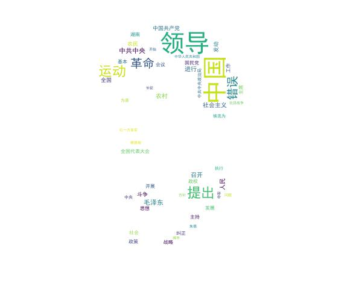

# word_cloud
 A toolbox or kit for image-shape adjusted word cloud based on plain text, local file or web articles,  
面向本地文件, 在线网页, 程序输入的字符云自动生成组件,支持用户自定义图片字符形状, 生成给定网页,文本的高频词和关键词词云.        

# How to run?

```shell
bash run.sh
```

This command will create the environment that needed by the project.  
This project is created on the purposes of easy-on-run.  
If you want to know the details about the preject, just read code.  
 
# 项目由来

本项目面向本地文件, 在线网页, 程序输入的字符云自动生成组件,支持用户自定义图片字符形状, 生成给定网页,文本的高频词和关键词词云.  

# 项目主要功能

本项目支持三种类型的高频词和关键词可视化接口,关键词采用通用的tfidf算法提取而成.  

1) 文本  
2) 本地文件  
2) url  

# 效果展示:
1) 用户本地文件  
源文件:text/mao.txt  
效果:  
高频词  
  

关键词  
  


2) 用户指定网页url  
原url:"https://news.sina.com.cn/o/2019-01-26/doc-ihrfqzka1140567.shtml"  
效果:  
高频词  
  

关键词
  

3) 用户输入文本  
原文本:  

    豫章故郡，洪都新府,星分翼轸，地接衡庐。襟三江而带五湖，控蛮荆而引瓯越。物华天宝，龙光射牛斗之墟；人杰地灵，徐孺下陈蕃之榻。雄州雾 列，俊采星  驰……。这是唐代著名诗人王勃《藤王阁序》中介绍江西首府“南昌”的诗，江西的情况从这儿可以略知一二，南昌还有世界动感都会、文明花园城市之称，更是中     国人民解放军的诞生地，有英雄城之称。
    江西，简称赣，是典型的江南鱼米之乡。因公元733年唐玄宗设江南西道而得省名。是人杰地灵、钟灵毓秀、物华天宝之处。江西是革命老区，江西人民为中国   革命做出了卓著贡献，毛主席等老一辈无产阶级革命家创建的第一个革命根据地“井冈山”就在江西，经过解放后改革开放几十年的发展，江西成为中国经济比较    发达的内陆对外开放省份。江西东邻浙江、福建，南嵌广东，西靠湖南，北毗湖北、安徽而共接长江，为长江三角洲、珠江三角洲和闽南三角洲经济发达地            区的共同腹地，区位极为优越。省境内除北部较为平坦外，东西南部三面环山，中部丘陵起伏，成为一个整体向鄱阳湖倾斜而往北开口巨大盆地。全境有大小           河流2400余条，赣江、抚河、信江、修河和饶河为江西五大河流，江西的风景形胜也是全国独特，李白的《望庐山瀑布》一诗描写了庐山的壮美，其实江西的         三清山、龙虎山等与庐山是难分伯仲的，三清山是世界文化自然遗产，您只要上一回三清山，就感到它不亚于黄山，真是仙人之居所。不亏为世界第一的花岗岩          山……大美的江西，人间的天堂

效果:  
高频词  
  

关键词  
  

# 总结
1) 本项目针对目前开源软件中缺少根据用户自定义图像进行词频与关键词分析形成词云的现状,完成了一个基于python与wordcloud组件的可视化项目.  
2) 本项目支持用户本地文件,用户输入字符串,用户输入文本网址三种模式的词云生成接口  
3) 本项目支持用户对本地文件进行高频词展示和关键词展示,使用了常用的TFIDF算法,支持用户对展示的词数进行设定  
